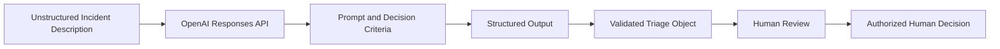

# MissionOps AI — Secure AI Operations Copilot

**OpenAI Academy API Builder Bootcamp portfolio project**

MissionOps AI is an evolving, production-oriented reference application for turning unstructured operational incidents into structured, human-reviewed decisions and, in later phases, grounded and bounded AI-assisted investigation workflows.

> **Architecture principle:** Complexity should earn its way into the system.

## Why this project exists

The project follows the engineering discipline emphasized in OpenAI Academy's API Foundations session:

**Diagnose → Choose → Defer → Validate**

Before adding RAG, tools, agents, or realtime interaction, MissionOps first proves the smallest useful capability with representative evals.

## Part 1 — API Foundations

### First useful slice

**Unstructured incident description → OpenAI Responses API → Structured incident triage → Human review**

MissionOps v0.1 focuses on:

- Incident classification
- Severity assessment
- Escalation recommendation
- Recommended next action
- Structured Outputs
- Rationale and confidence
- Missing-information detection
- Representative eval cases
- Human-review-only safety boundary

### Intentionally deferred

- RAG / File Search
- External operational tools
- Agents
- Realtime voice
- Production side effects

## Architecture


**Safety boundary**  MissionOps v0.1 does not execute automated production actions. Human review remains required before any operational decision.

See [`docs/architecture/part-1.md`](docs/architecture/part-1.md).

## Quick start

```bash
git clone https://github.com/Arcell78/missionops-ai.git
cd missionops-ai
python -m venv .venv
```

Activate the environment, then:

```bash
pip install -r requirements.txt
cp .env.example .env
python -m missionops.cli
```

On Windows PowerShell, activate with:

```powershell
.venv\Scripts\Activate.ps1
```

Never commit your `.env` file or API key.

## Google Colab

Use:

[`notebooks/missionops_v01_colab.ipynb`](notebooks/missionops_v01_colab.ipynb)

## Example structured result

```json
{
  "category": "deployment",
  "severity": "high",
  "escalation_required": true,
  "recommended_action": "investigate",
  "rationale": "Failures began shortly after a production deployment.",
  "confidence": 0.91,
  "missing_information": [
    "deployment health status",
    "application error logs",
    "affected service scope"
  ]
}
```

## Evals

The starter set contains **30 synthetic incidents** across availability, performance, security, deployment, database, network, ambiguous, conflicting-evidence, and high-risk scenarios.

Run:

```bash
python evals/run_eval.py
```

Initial scoring measures:
- category exact match,
- severity exact match,
- escalation exact match,
- recommended-action exact match,
- successful structured parsing,
- latency.

## Repository structure

```text
missionops-ai/
├── .github/workflows/
├── docs/
│   ├── architecture/
│   ├── adr/
│   └── assets/
├── notebooks/
├── src/missionops/
├── evals/
├── examples/
├── tests/
├── session-1-api-foundations/
├── session-2-agents/
├── session-3-realtime/
├── session-4-rag/
└── session-5-production/
```

## Five-part roadmap

| Part | Bootcamp focus | MissionOps capability |
|---|---|---|
| 1 | API Foundations | Structured incident triage + eval baseline |
| 2 | Agents | Bounded tools, workflow vs. agent decision, adaptive investigation |
| 3 | Realtime | Low-latency conversational operations interface |
| 4 | RAG | Grounded operational knowledge using approved sources |
| 5 | Production & Optimization | Expanded evals, reliability, observability, guardrails, latency and cost optimization |

## Safety boundary

MissionOps v0.1 **does not execute production changes**.

It may classify, assess, recommend, and request more information. It may not restart services, roll back deployments, modify IAM/network policy, disable accounts, or resolve incidents.

Use synthetic/public demonstration data only.

## Website

`https://arcell-in-ai.mitchellkid78.chatgpt.site`

## Official OpenAI references

- `https://platform.openai.com/docs/quickstart`
- `https://platform.openai.com/docs`
- `https://openai.github.io/openai-agents-python/`

## Status

**Part 1 — API Foundations: In progress**

Next milestone: establish the v0.1 evaluation baseline and use the findings to determine what earns its way into Part 2.
