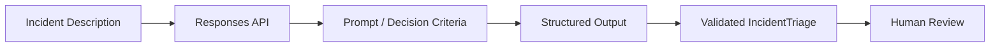

# Part 1 Architecture — API Foundations

## First useful slice

> Can an unstructured incident description be converted into a reliable,
> structured triage recommendation for human review?

## Diagnostic category

**Behavior**

The first test uses information already present in the incident description.

## Architecture

## Human-review boundary

The model may classify, assess severity, recommend escalation, request missing information, and explain rationale.

The model may not restart services, roll back deployments, disable accounts, change IAM/network policy, close incidents, or claim remediation occurred.

## Deferred capability

RAG, tools, agents, and realtime are deferred until a demonstrated Context,
Action, or interface requirement justifies them.
